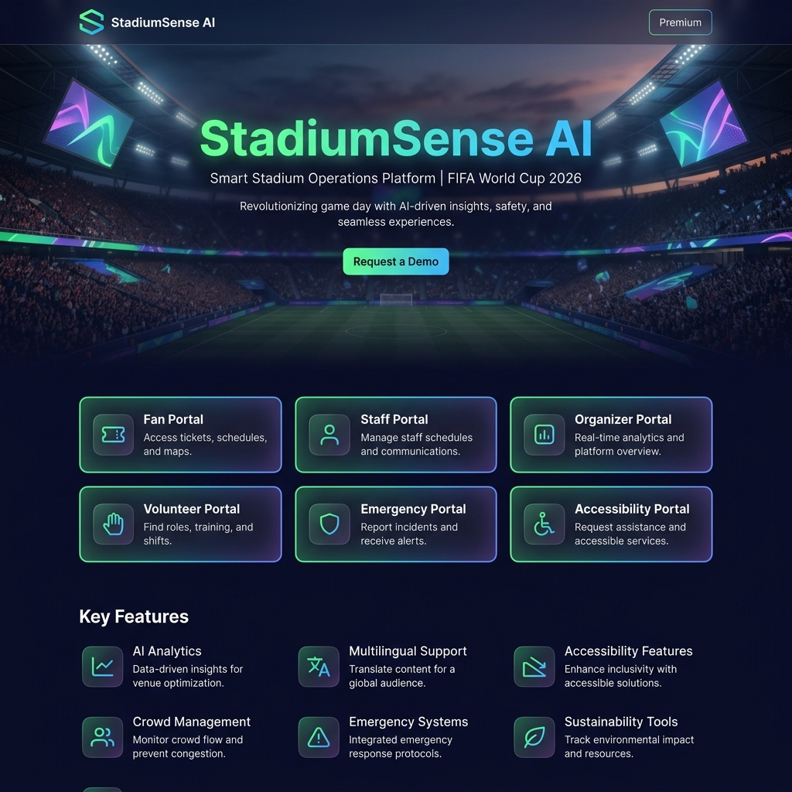
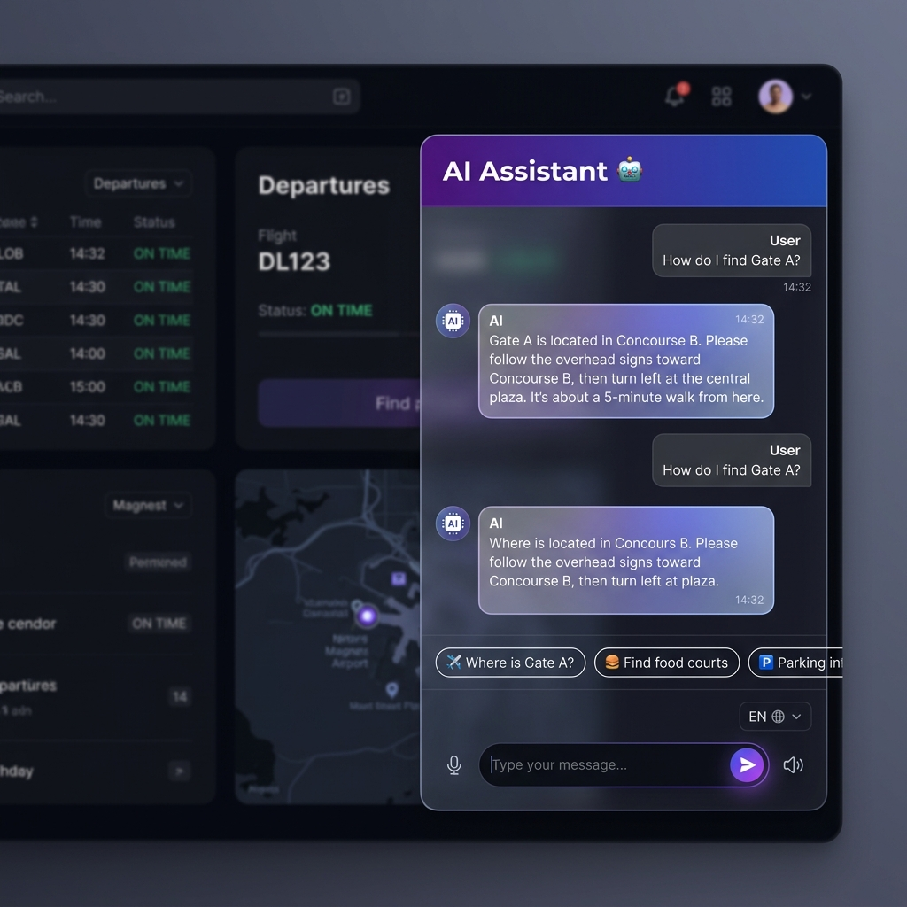
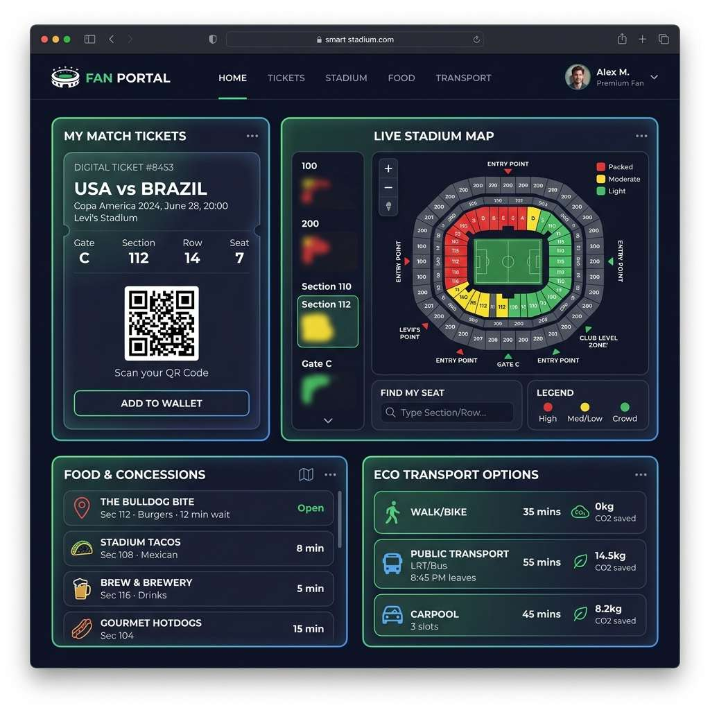
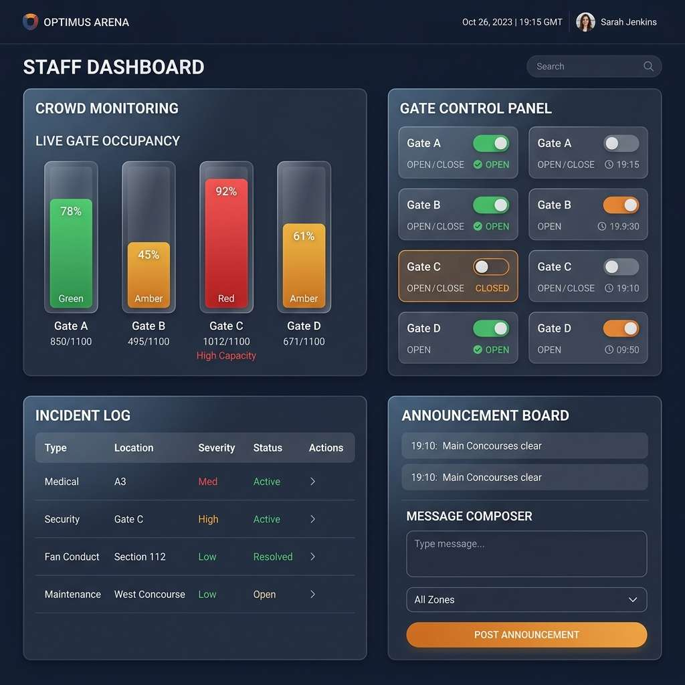
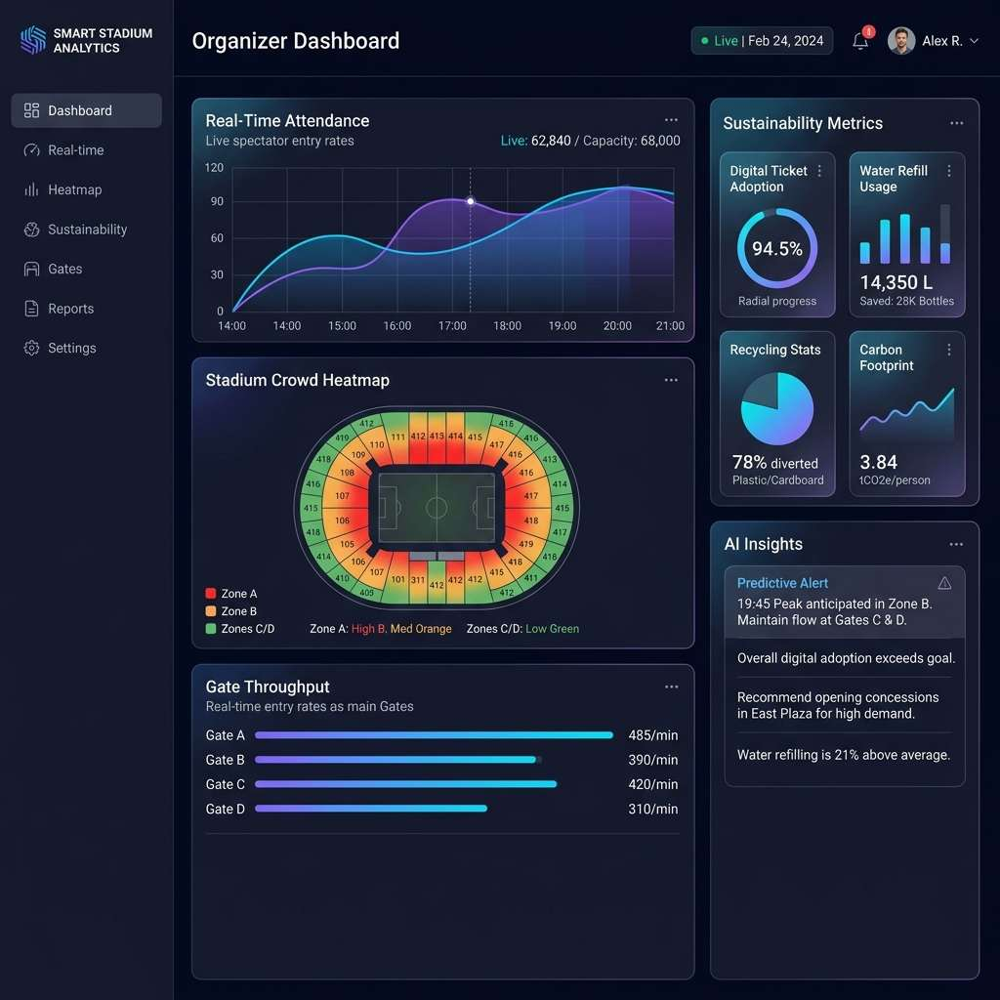
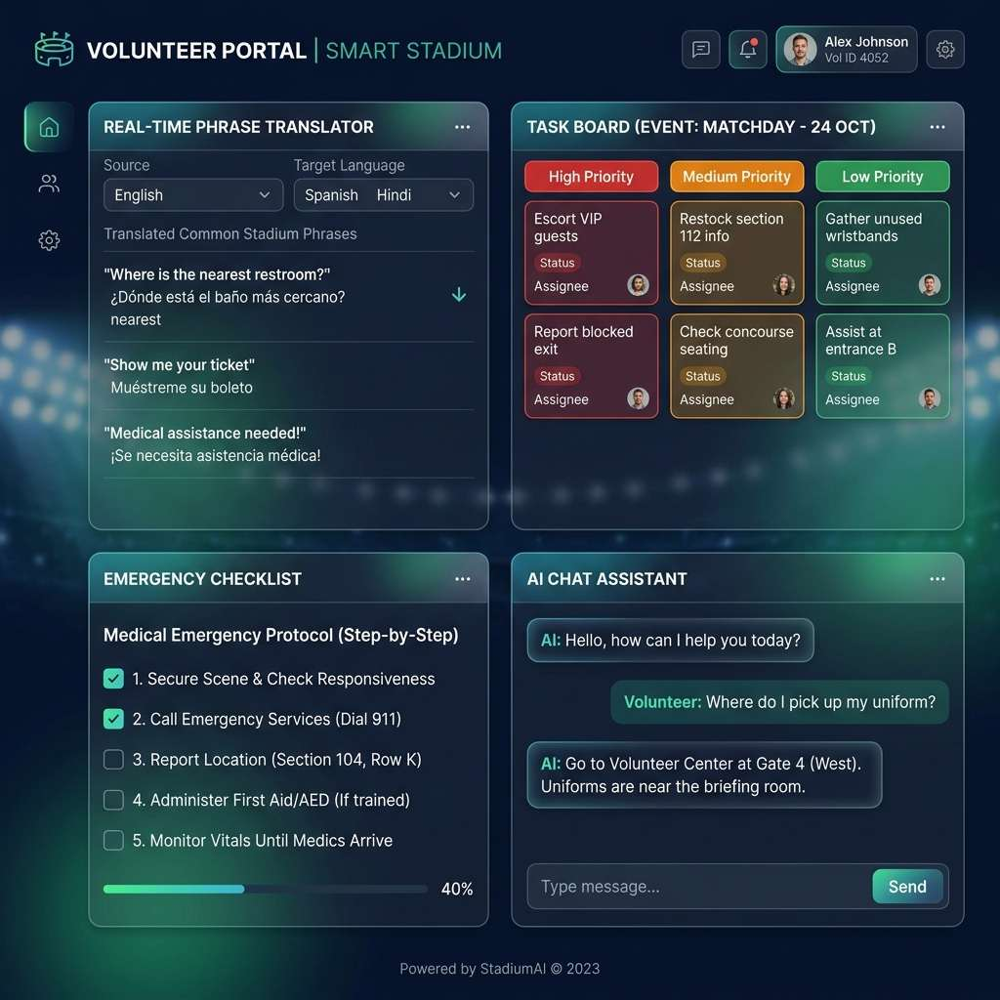
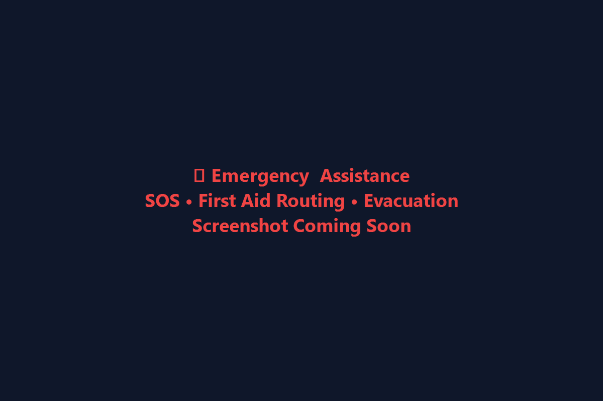
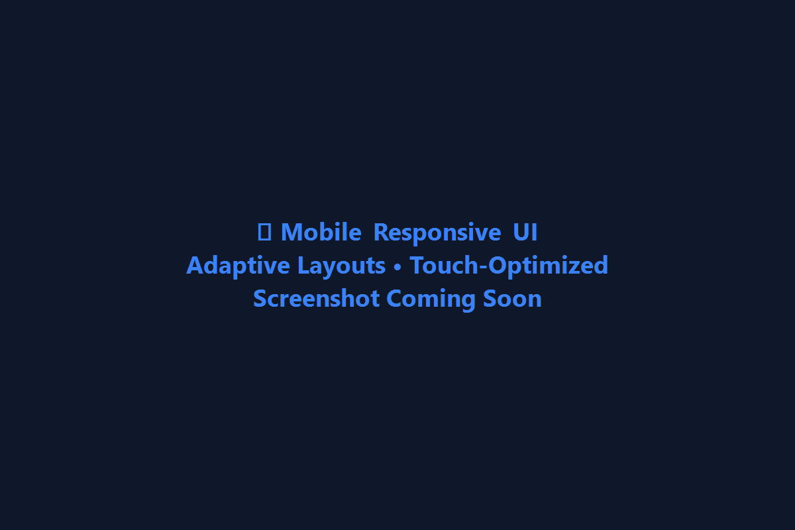

# 🏟️ StadiumSense AI

### Smart Stadium Operations & Tournament Assistant for FIFA World Cup 2026


StadiumSense AI is an enterprise-grade, production-ready smart stadium operations and fan experience platform designed for the FIFA World Cup 2026. The system leverages Google Gemini AI, real-time crowd simulations, multilingual localization, and strict WCAG 2.1 AA accessibility features to provide a unified digital solution for fans, stadium staff, event organizers, and volunteers.

---

## 📖 Table of Contents
- [Project Overview](#project-overview)
- [Challenge Statement](#challenge-statement)
- [Features](#features)
- [Tech Stack](#tech-stack)
- [Project Architecture](#project-architecture)
- [Folder Structure](#folder-structure)
- [Application Screenshots](#application-screenshots)
- [Installation](#installation)
- [Testing](#testing)
- [Environment Variables](#environment-variables)
- [Deployment](#deployment)
- [Future Enhancements](#future-enhancements)
- [License](#license)
- [Author](#author)

---

## Project Overview
StadiumSense AI is built to manage complex match-day operations at MetLife Stadium. By integrating real-time intelligence with personalized user portals, the platform bridges the gap between stadium operations and the fan experience, ensuring safety, efficiency, accessibility, and sustainability.

---

## Challenge Statement
Managing a massive international event like the FIFA World Cup 2026 presents unique operational challenges:
- High crowd density leading to gate congestion and safety hazards.
- Language barriers for international fans and volunteers.
- The need for rapid, coordinated emergency response.
- Catering to diverse accessibility needs under high-stress conditions.
- Tracking environmental sustainability goals like carbon footprint and eco-transport.

StadiumSense AI addresses these challenges with a single, highly-integrated web platform powered by Google Gemini AI.

---

## Features

### 👥 Fan Features
- **Digital Tickets**: Quick-access match tickets with gate assignments.
- **Seat Finder**: Zone-mapped routing based on seat location.
- **Interactive Heatmap**: Visual crowd density indicators across MetLife Stadium.
- **Parking & Eco-Transport**: Real-time parking availability and carbon footprint calculator.
- **Food & Facilities**: Concession directory with live wait times.

### 🛡 Staff Features
- **Gate Monitoring**: Live gate occupancy status (low/medium/high) with wait-time estimators.
- **Incident Dispatch**: Real-time logging, tracking, and prioritizing of operational issues.
- **Public Announcements**: Instant multilingual broadcast capability.
- **Gate Controls**: Ability to open, close, or redirect crowd flows.

### 📊 Organizer Features
- **Match-day Analytics**: Live throughput graphs, peak hours, and attendance trends.
- **Sustainability Hub**: Eco metrics tracking recycling, water refills, and carbon savings.
- **Gemini AI Insights**: Automated operational recommendations based on active data patterns.

### 🙋 Volunteer Features
- **Phrase Translator**: Multi-way offline translation tool with preloaded common phrases.
- **Shift & Task Checklist**: Real-time task synchronization.
- **Emergency Cheat Sheet**: Standard operating procedures for medical, fire, and security events.

### 🤖 AI Features
- **Contextual Assistant**: Smart floating AI helper powered by Google Gemini 2.0.
- **Offline Fallback**: Rule-based backup engine ensuring 100% functionality offline.
- **Voice Commands**: Web Speech API integration for hands-free navigation.
- **Text-to-Speech**: Automated audible feedback for all AI responses.

### ♿ Accessibility
- **WCAG 2.1 AA Compliance**: Strict color contrast ratios and keyboard navigation.
- **Screen Reader Mode**: Enhanced ARIA labels across interactive elements.
- **Font & Theme Controls**: High-contrast toggles and text-resizing tools.
- **RTL Language Layouts**: Native support for Arabic and other RTL languages.

### 🚨 Emergency Support
- **SOS Button**: Double-tap protection with a 3-second countdown to prevent false alarms.
- **Emergency Exits**: Dynamic route calculation to the nearest exits.
- **First Aid Locator**: Real-time tracking and direction to the nearest medical station.

### 🌍 Multilingual Support
- **Full Localization**: Complete translation dictionaries for English, Spanish, Hindi, Telugu, French, and Arabic.
- **Cross-lingual Chat**: AI communicates natively in the user's selected language.

### 🌱 Sustainability
- **Refill Locator**: Dynamic routing to drinking water refill stations.
- **Recycling Analytics**: Tracking plastic/paper recycling kiosks.
- **Transit Rewards**: Visualization of carbon offsets from public transit usage.

---

## Tech Stack

| Technology | Purpose | Key Details |
| --- | --- | --- |
| **Next.js 16** | Core Web Framework | App Router, SSR, API routes |
| **TypeScript** | Static Typing | Strict mode, robust interfaces |
| **Tailwind CSS** | Styling | Custom dark theme, glassmorphism |
| **Gemini AI** | Intelligence | Google Gemini 2.0 Flash API |
| **Web Speech API**| Accessibility | Voice recognition & Text-to-Speech |
| **Vercel** | Hosting | Instant global edge deployment |

---

## Project Architecture
```
                     ┌────────────────────────────────────────────────────────┐
                     │              StadiumSense AI Web Platform              │
                     └──────────────────────────┬─────────────────────────────┘
                                                │
         ┌──────────────────────┬───────────────┼───────────────┬──────────────────────┐
         ▼                      ▼               ▼               ▼                      ▼
  🎫 Fan Portal          🛡️ Staff Portal  📊 Organizer    🙋 Volunteer Hub       🚨 Emergency SOS
   (/fan)                 (/staff)        (/organizer)    (/volunteer)            (Global Trigger)
         │                      │               │               │                      │
         └──────────────────────┴───────────────┼───────────────┴──────────────────────┘
                                                ▼
                                    ┌──────────────────────┐
                                    │ Shared Components    │
                                    │ - LayoutHeader       │
                                    │ - StadiumMap (SVG)   │
                                    │ - AIAssistant        │
                                    │ - CrowdSimulator     │
                                    │ - AccessibilityPanel │
                                    └───────────┬──────────┘
                                                ▼
                                    ┌──────────────────────┐
                                    │ React Custom Hooks   │
                                    │ - useLanguage        │
                                    │ - useAccessibility   │
                                    │ - useCrowdDensity    │
                                    └───────────┬──────────┘
                                                ▼
                                    ┌──────────────────────┐
                                    │ Utilities & Engines  │
                                    │ - gemini.ts (AI)     │
                                    │ - dictionary.ts      │
                                    │ - mockData.ts        │
                                    └──────────────────────┘
```

---

## Folder Structure
```
stadiumsense-ai/
├── public/                  # Static assets & icons
├── screenshots/             # Application interface screenshots
├── src/
│   ├── app/                 # Next.js App Router (pages & API routes)
│   │   ├── api/             # Gemini API proxy handler
│   │   ├── fan/             # Fan Portal Page
│   │   ├── organizer/       # Organizer Dashboard Page
│   │   ├── staff/           # Staff Dashboard Page
│   │   ├── volunteer/       # Volunteer Hub Page
│   │   ├── globals.css      # Custom styles and animations
│   │   ├── layout.tsx       # Root layout & page metadata
│   │   └── page.tsx         # Welcome Landing Page
│   ├── components/          # Reusable React components
│   │   ├── AIAssistant.tsx  # Floating Gemini Chat Widget
│   │   ├── CrowdSimulator.tsx # Density controllers
│   │   ├── LayoutHeader.tsx # Navigation & system settings
│   │   ├── SOSButton.tsx    # Panic button countdown
│   │   └── StadiumMap.tsx   # SVG layout and heatmap
│   ├── context/             # React context state provider
│   ├── hooks/               # Custom hooks (Localization, Accessibility, Density)
│   ├── types/               # TypeScript interfaces
│   └── utils/               # App helper modules (mock data, translation dictionaries)
├── .gitignore
├── eslint.config.mjs
├── package.json
├── postcss.config.mjs
├── README.md
└── tsconfig.json
```

---

## Application Screenshots

### Home Page
The main entry point with access to all six persona portals, active occupancy counters, and a modern dark glassmorphic design.



---

### AI Assistant
The conversational Gemini AI chat drawer featuring voice dictation, multilingual answers, and quick operational queries.



---

### Fan Portal
Interactive stadium heatmap map, digital seat directions, travel carbon calculator, and eco metrics dashboard.



---

### Staff Dashboard
Operations dashboard showing active gate congestion, incident lists, dispatch controls, and public announcements.



---

### Organizer Dashboard
Executive view detailing attendance tracking charts, zone heatmaps, sustainability achievements, and automated AI analysis.



---

### Volunteer Portal
Localized phrase translator, dynamic task lists, and structured emergency checklist guides.



---

### Emergency
Pulsing emergency hub with SOS countdown, immediate first aid routing, and medical responder status tracker.



---

### Mobile
Fully fluid mobile viewport adaptations with bottom navigation bar and large touch targets for seamless accessibility.



---

## Installation

### 1. Clone the repository
```bash
git clone https://github.com/mummanadeviprasad456-dev/stadiumsense-ai.git
cd stadiumsense-ai
```

### 2. Install dependencies
```bash
npm install
```

### 3. Run in development mode
```bash
npm run dev
```

---

## Testing

StadiumSense AI includes a complete testing setup using [Vitest](https://vitest.dev/) and [React Testing Library](https://testing-library.com/docs/react-testing-library/intro).

To run all unit and integration tests:
```bash
npm test
```

### Sample Test Output
```
> promptwars@0.1.0 test
> vitest run


 RUN  v4.1.10 C:/Users/mumma/OneDrive/Desktop/promptwars

 ✓ tests/SOSButton.test.tsx (4 tests) 1008ms
 ✓ tests/gemini.test.ts (4 tests) 3250ms
 ✓ tests/LandingPage.test.tsx (4 tests) 2224ms
 ✓ tests/OrganizerDashboard.test.tsx (5 tests) 2165ms
 ✓ tests/VolunteerPortal.test.tsx (8 tests) 2496ms
 ✓ tests/FanPortal.test.tsx (6 tests) 2608ms
 ✓ tests/StaffPortal.test.tsx (4 tests) 2130ms
 ✓ tests/useAccessibility.test.ts (5 tests) 108ms
 ✓ tests/AIAssistant.test.tsx (3 tests) 773ms
 ✓ tests/StadiumMap.test.tsx (3 tests) 536ms
 ✓ tests/CrowdSimulator.test.tsx (2 tests) 498ms
 ✓ tests/useLanguage.test.ts (3 tests) 60ms
 ✓ tests/LayoutHeader.test.tsx (3 tests) 327ms
 ✓ tests/useCrowdDensity.test.ts (3 tests) 49ms
 ✓ tests/dictionary.test.ts (3 tests) 5ms

 Test Files  15 passed (15)
      Tests  60 passed (60)
   Start at  17:14:55
   Duration  21.68s (transform 2.08s, setup 8.95s, import 21.05s, tests 18.24s, environment 68.89s)
```

---

## Environment Variables
Create a `.env.local` file in the root directory and add the following variable:
```env
NEXT_PUBLIC_GEMINI_API_KEY=YOUR_GEMINI_API_KEY
```
*Note: The platform is built with a local rule-engine fallback and will work 100% offline if no API key is provided.*

---

## Deployment
This project is configured for easy deployment on Vercel:
1. Connect your GitHub repository to Vercel.
2. Add `NEXT_PUBLIC_GEMINI_API_KEY` under Environment Variables in the project settings.
3. Deploy!

---

## Future Enhancements
- **Dynamic MapGL Integration**: Move from custom SVG maps to high-fidelity Mapbox or Google Maps overlays.
- **Gemini Vision Support**: Enable OCR to scan on-site signs and translate them for users in real-time.
- **PWA Notification Push**: Real-time push alerts to user devices for immediate crowd notifications.
- **AR Wayfinding Overlay**: Walkthrough navigation inside the stadium using the device's camera.

---

## License
Distributed under the MIT License. See `LICENSE` for more information.

---

## Author
Developed by the StadiumSense AI Team for the PromptWars Challenge 4.
